# **Throwback Developments - Introduction**
Throwback Developments is a fully functioning E-Commerce store supplying retro vehicle parts, utilising Stripe as the payment processor. The site was built in Django using HTML, CSS, Javascript, Python and the Bootstrap libraries, incorporating user authentication and full CRUD functionality for the management of products. For the purposes of this project, the site does not take real card payments and a test card number has been set up:

Card number - 4242 4242 4242 4242 

Expiration date - any future date

CVC - any three-digits

Postcode or zipcode - any five-digits

[Throwback Developments](https://throwback-developments.herokuapp.com/) - The live site can be viewed here.

## **TABLE OF CONTENTS**

 - [**Business Strategy**](#business-strategy)
    * [Business Model](#business-model)
    * [Web Marketing](#web-marketing)
    * [Search Engine Optimisation](#search-engine-optimisation)
 - [**User Experience (UX)**](#user-experience)
    * [User Stories](#user-stories)
    * [Agile Methodology](#agile-methodology)
    * [The Scope](#the-scope)
 - [**Design**](#design)
    * [Colours](#colours)
    * [Typography](#typography)
    * [Media](#media)
    * [Wireframes](#wireframes)
    * [Database Schema](#database-schema)
 - [**Features**](#features)
    * [Existing Features](#existing-features)
    * [Features to Add](#features-to-add)
 - [**Technologies Used**](#technologies-used)
    * [Languages](#languages)
    * [Frameworks](#frameworks)
    * [Libraries](#libraries)

 ## **BUSINESS STRATEGY**

 

### **Business Model**

 

### **Web Marketing**

 

### **Search Engine Optimisation**

## **USER EXPERIENCE (UX)**

 

### **User Stories**

 

- #### **Unregistered site user:**

   - As a user, I can quickly understand the sites purpose and navigate through the sites content easily, without any confusion.
   - As a user, I can view a list of featured products on the landing page with clearly visible images, titles and prices.
   - As a user, I can subscribe to a Newsletter with my email address and receive updates and offers.
   - As a user, I can make enquiries via the contact form.
   - As a user, I can click each product to view the product details including price, SKU, category, description, rating and product reviews.
   - As a user, I can organise products in the products list by category, rating in descending order and price in ascending order.
   - As a user, I can easily register for an account which stores my name and address details once completed.

 

- #### **Regsitered site user:**

   - As a user, I am able to receive a confirmation email once my account has been registered.
   - As a user, I can add products I like to my wishlist and remove products no longer required.
   - As a user, I can easily log in and log out of my account and receive a pop up message alert to notify me of the action.
   - As a user, I can add product reviews and ratings to products I have purchased so that others can see my experience.
   - As a user, I can access my account information to view my order history including the order number, date purchased and products purchased.

 

- #### **Shopping site user:**

   - As a user, I have access to all of the above features.
   - As a user, I can add products to my basket so I am able to get a total cost of all the parts I am interested in.
   - As a user, I can easily view my order summary including my saved account details and my basket contents before entering my payment details without any confusion.
   - As a user, I am able to view a full order confirmation once a payment has been submitted and receive a message informing me my order confirmation email has been sent.

 

- #### **Site Admin/Superuser:**

   - I can quickly and easily add new products to the store via the admin tools menu in the navbar.
   - I can edit a products title, description or image via the product listing page and product details page, so that I can effectively maintain the shop.
   - I can remove products from the site via the product listing page or product details page.
   - I can update the products that appear in the featured products section.
   - I can view messages sent through the sites contact form via the admin panel.

### **Agile Methodology**

 

### **The Scope**

 

#### **The Site's Main Goals:**

## **DESIGN**

 

### **Colours**
The colour pallette chosen for this project was kept simple with 3 primary colours being used for the design. A soft background colour (#F0F3F4) was used to help keep the users focus on the site content without too much distraction, a darker grey (#37393A) was used for menu text and icons for a pleasant contrast and (#F7B91E) was chosen for some button background colours as a gentle nod towards a vehicle registration plate.

 

### **Typography**
For this project I decided to use 2 fonts, 'Oswald' for the main body text and 'Bebas Neue' for any heading elements used. These fonts provide the user with a clean and easy to read text whilst also bringing an element of style to the overall feel of the page. 

 

### **Wireframes**
I started my design process by creating wireframes using [Balsamiq](https://balsamiq.com/). Wireframes were a useful tool to help guide development decisions as the project progressed. Some design choices were changed along the way in place of a better overall user experience.

Wireframes for each page are linked here:

[Home Page](docs/read-me/home-page.png)

[All Products Page](docs/read-me/all-products.png)

[Product Details Page](docs/read-me/product-details.png)

[Shopping Basket Page](docs/read-me/basket.png)

[Order Checkout Page](docs/read-me/checkout-page.png)

[Order Confirmation Page](docs/read-me/order-confirmation.png)

[Account Signup Page](docs/read-me/signup.png)

[Account Login Page](docs/read-me/login.png)

[Contact Page](docs/read-me/contact-page.png)

 

### **Database Schema**

## **FEATURES**

 

### **Existing Features**

 

- #### **Navigation Bar**

   - The navigation bar is located at the top of the page on every page of the site and contains the site Logo on the left hand portion, the search bar in the center and the wishlist, user account and basket menu icons on the right. Below these are the menu icons for the home page, the product categories and the contact us pages. 

   - The navbar is fixed to the top of the screen when users scroll down the page, this allows users to easily navigate through the menu icons to quickly find what they are looking for without the need to scroll back to the top of the page.

   - The basket menu icon updates the basket total when products are added so users are able to see the total cost of the basket content while browsing the site.

   - Drop down menu links were used to further improve the navigation of the product categories, allowing users to define which specific type of product they would like to view.

   - Unregistered users are prompted to register or login when the wishlist or user account icons are selected.

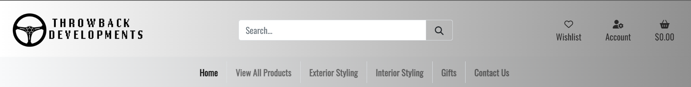

 

- #### **Mobile Navbar**

   - The navbar is fully responsive and on smaller device screens the logo image disappears and the home page, product categories and contact page links are collapsed into a toggler menu. The search bar is reduced to a search icon and sits next to wishlist, user account and basket menu icons.

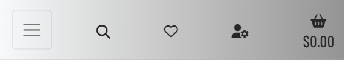

 

- #### **Footer**

   - Located at the bottom of the each page is the footer which contains 2 sections. The upper section has an email field to allow users to subscribe to the site's newsletter.

   - The lower section contains menu icons for the site's Privacy Policy and Contact page on the left side and links to the Throwback Developments Facebook, Youtube, Instagram and Linkedin social media accounts on the right side.

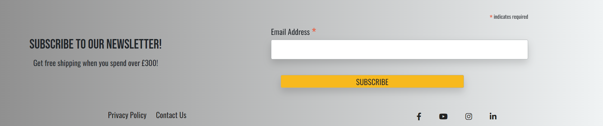

 

- #### **Home Page**

   - When user's land on the home page they are presented with a hero image with a link to view all products. The image used for the hero image is a stylish representation of the products that Throwback Developments specialises in, giving the user a clear sense of the site's purpose.

   - Beneath the Hero image is the 'Featured Products' section which displays any products selected to be featured by the site admin.

   - At the bottom of home page is a carousel reel with stylish images and useful information for the user.

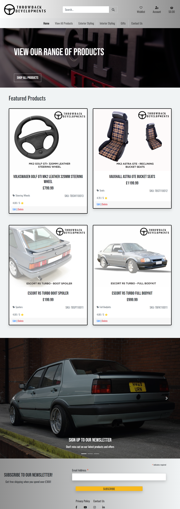

 

- #### **All Products Page**

   - The All Products Page displays every available product on the site into 3 columns and features a filter option below the title. The filter allows users to filter products by category and price in ascending order and rating in descending order.

   - Each product is presented on a card featuring the product image at the top, product title, price, category, SKU and at the bottom a customer rating out of 5. 

   - For Authenticated Superusers additional 'edit' and 'delete' options are visible below the rating. This allows users easy access for product and shop maintenance.

   - The products page is fully responsive and reduces column size to 2 columns for medium devices and 1 column for smaller devie screens.

 

- #### **Product Details Page**

   - The Product Details Page provides the user with more detailed information about the product.

   - The product image is on the left side of the page with the product title, price, category, material, SKU and description inline on the right side.

   - Below this is a quantity box and a heart icon for users to add products to their wishlist. Underneath this are a 'keep shopping' button which returns users to the all products page and a 'add to basket' button for users to add the product to their basket.

   - At the bottom of the page users are presented with a product reviews section giving users the opportunity to view and provide their own personal feedback.

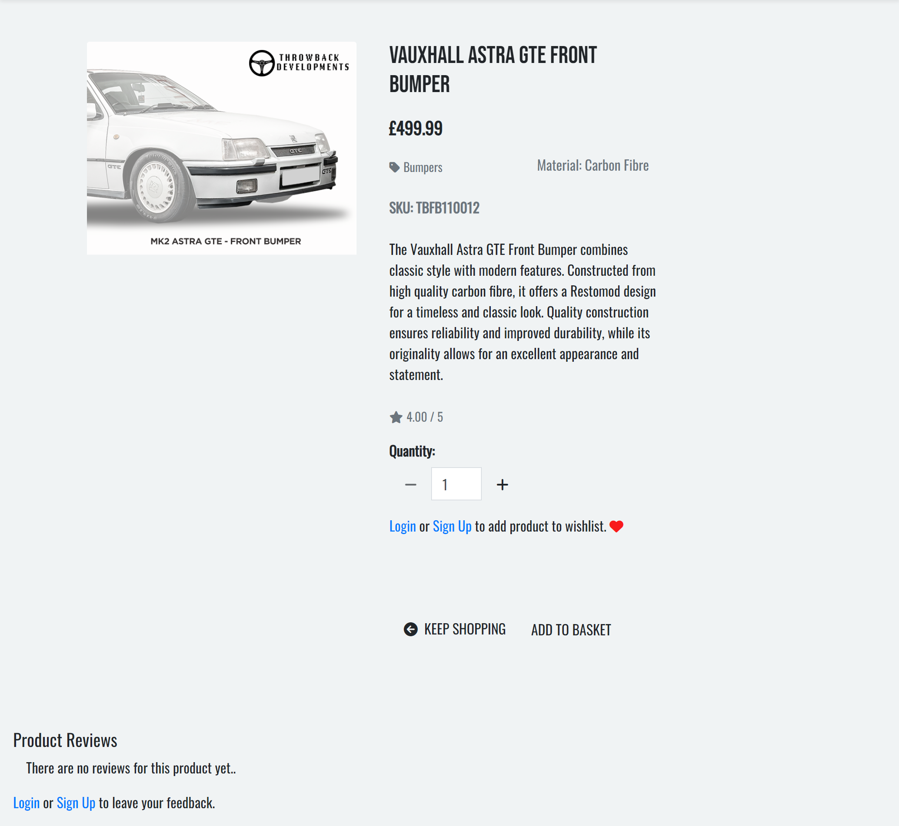

 

- #### **Product Details Authenticated User**

   - Unauthenticated users are presented with a 'register or login' opition in place of the 'add to wishlist' and 'add review' functionality. This is to ensure only authenticed users can add products to their wishlist and leave product reviews.

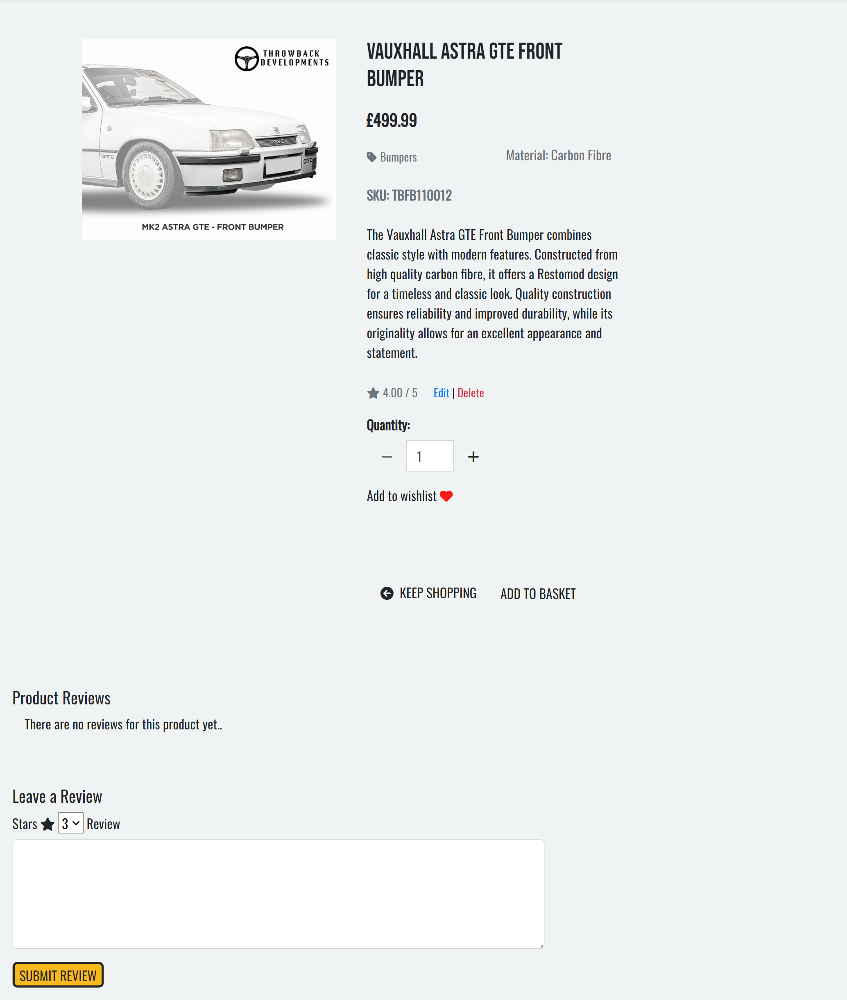

 

- #### **Contact Us Page**

   - The Contact Us Page was designed to be a simple and easy interaction for the user.

   - Users can select from one of the following message types from the dropdown box; Order Status, Product Enquiry and Custom Application Enquiry. 

   - Additionally, users are required to fill in their name, email address and enquiry.

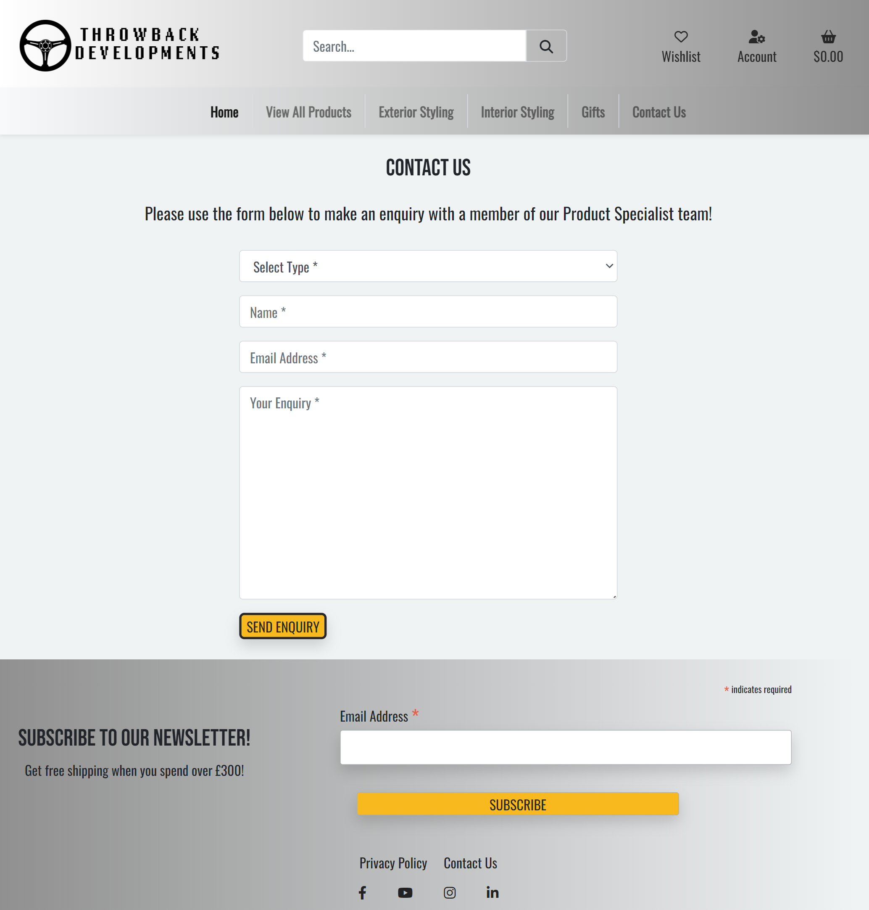

 

- #### **User Profile Page**

   - The User Profile Page is available to select from the navbar 'Account' menu and is only visible to authenticated users.

   - The page is divided into 2 columns with the user's information stored on the left side and the user's order history on the right side.

   - User's are able to update their phone number and address details as their default checkout details.

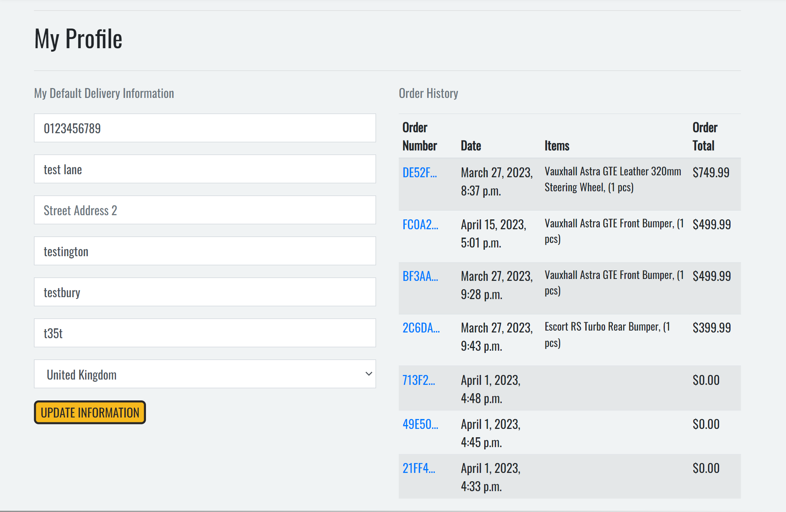

 

- #### **Shopping Basket**

   - The Shopping Bag Page provides users with a summary of the items in the basket and the total prices.

   - Each item in the basket has a product image, title, material, SKU, price, quantity and subtotal.

   - User's are able to update the product quantity and remove products from their basket.

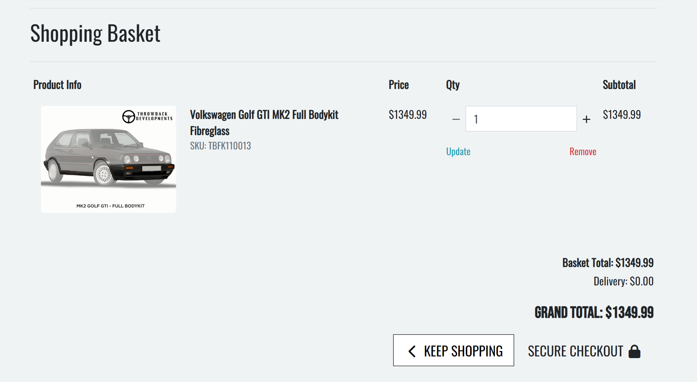

 

- #### **Checkout Page**

   - The Checkout Page is divided into 2 columns, the left side contains the users personal details and the right side contains the order information.

   - User's are able to checkout as a guest or as a registered user but are required to provide their information in the relevant fields before continuing.

   - Below the user information users can either select to go back and update their basket or continue with the purchase and confirm their order.

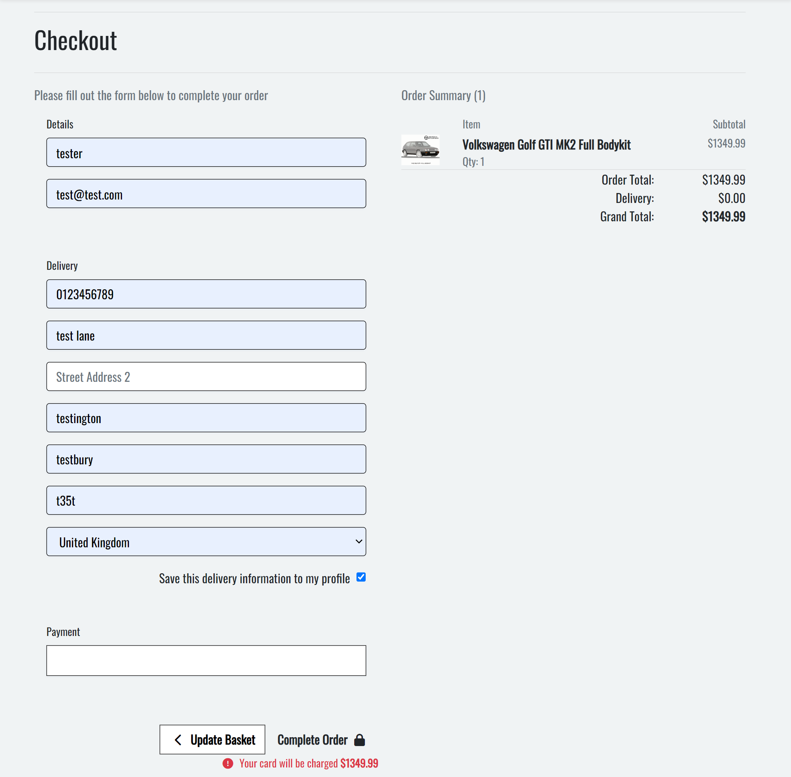

 

- #### **Checkout Success Page**

   - The Checkout Success Page displays the full order information to the user with a unique order number being generated and asigned to the order.

   - A confirmation message informs the user that a copy of the order confirmation has been sent to their email address.

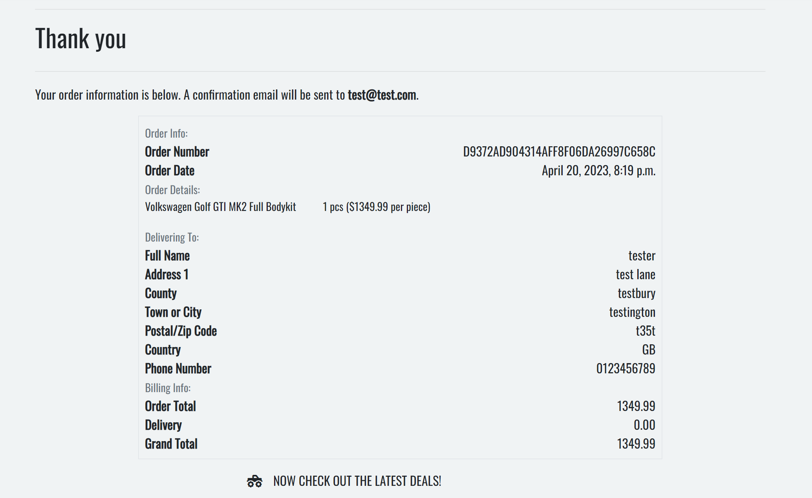

 

- #### **Add Product Page**

   - The Add Product Page is accessible through the 'Account' menu by selecting 'Admin Tools'.

   - This feature is only visible to superusers and gives the user the ability to add new products to the shop.

   - Users are required to fill in fields marked with an asterix so products can be consistently filtered on the all products page.

   - At the bottom of the add products page users are able to select if a product is featured or not.

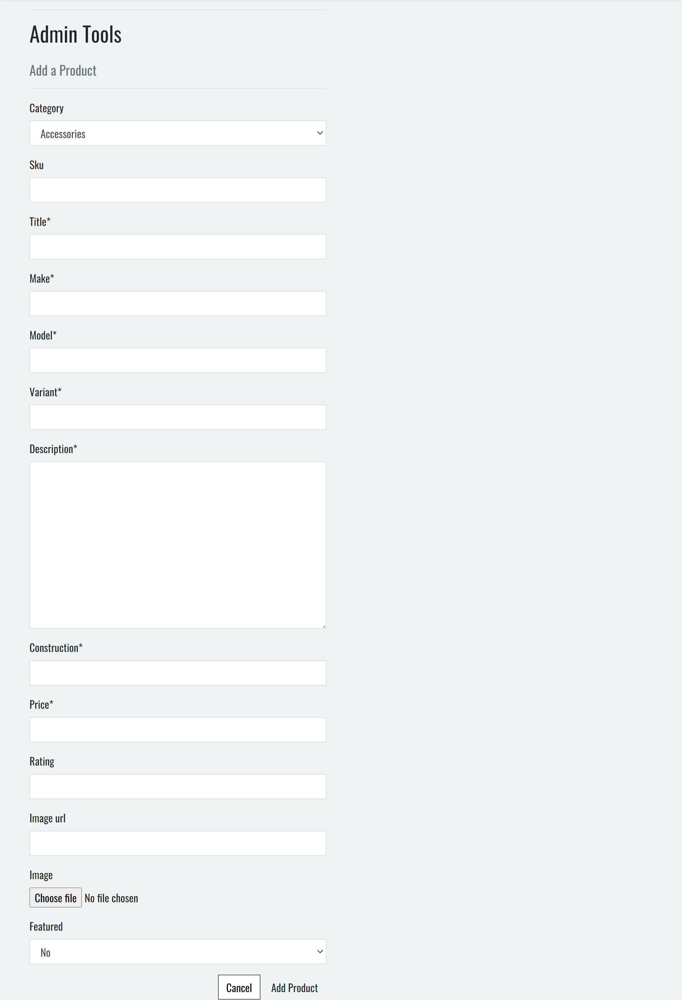

 

- #### **Account Registration Page**

   - The Sign Up Page allows users to register for an account and are asked to provide an email, username and password. 

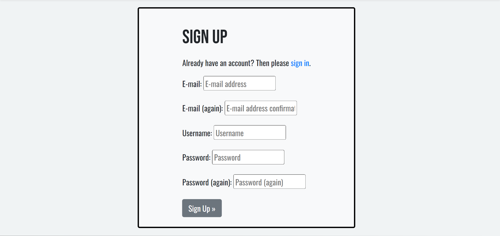

 

- #### **Login Page**

   - The Login Page allows users to enter their username and password and log in to their account.

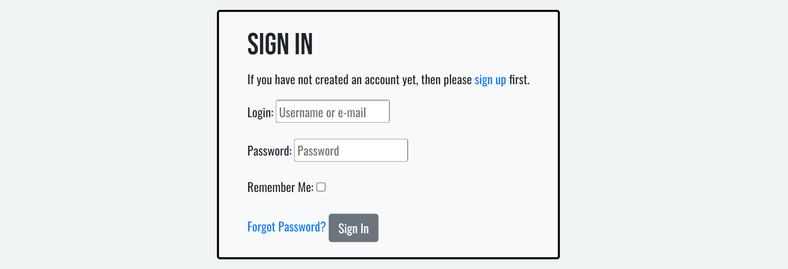

 

- #### **Logout Page**

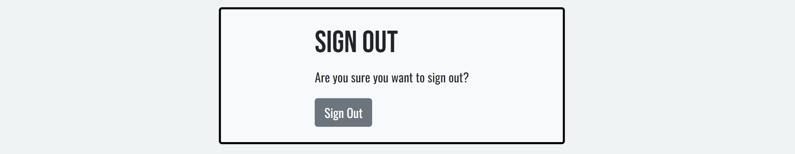

 

- #### **404 Error Page**

 

### **Features to Add**

   - FILL IN

## **Technologies Used**

 

- ### **Languages**

   - [HTML5](https://en.wikipedia.org/wiki/HTML5) 
   - [CSS3](https://en.wikipedia.org/wiki/CSS)
   - [JavaScript](https://en.wikipedia.org/wiki/JavaScript)
   - [Python](https://en.wikipedia.org/wiki/Python_(programming_language))

 

- ### **Frameworks**

   - [Bootstrap](https://getbootstrap.com/docs/4.6/getting-started/introduction/) framework provided the templates used for a fully responsice, mobile-first front end design. 
   - [Django](https://www.djangoproject.com/) framework provided the high-level Python templates used for this project.

 

- ### **Libraries**

   - The libraries used for this project are located in the requirements.txt file

   

