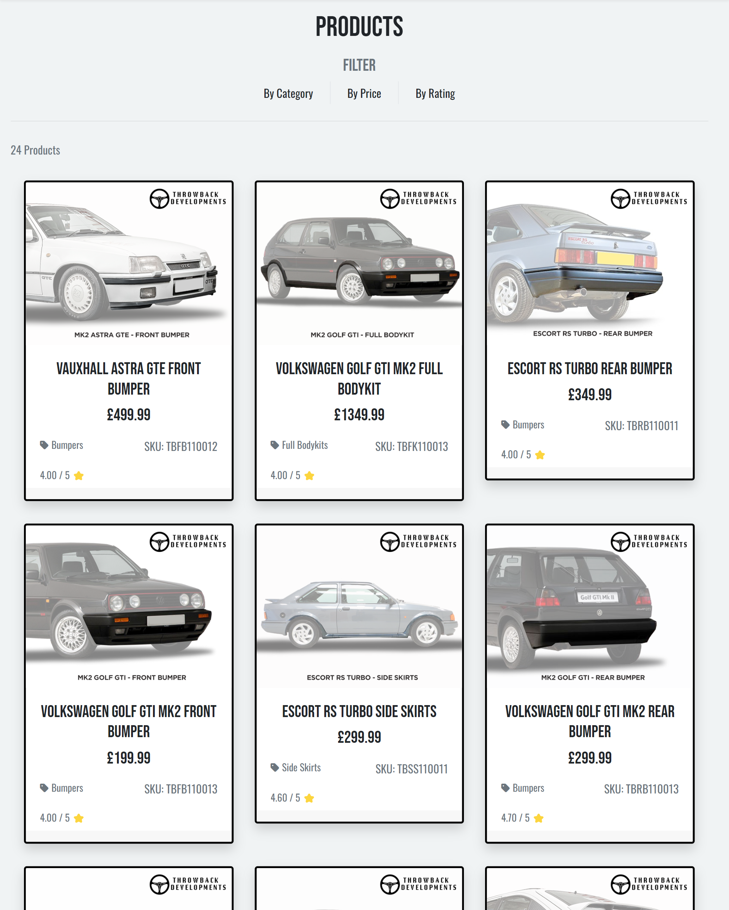

# **Throwback Developments - Introduction**
Throwback Developments is a fully functioning E-Commerce store supplying retro vehicle parts, utilising Stripe as the payment processor. The site was built in Django using HTML, CSS, Javascript, Python and the Bootstrap libraries, incorporating user authentication and full CRUD functionality for the management of products.

[Throwback Developments](https://throwback-developments.herokuapp.com/) - The live site can be viewed here.

## **TABLE OF CONTENTS**

 - [**Business Strategy**](#business-strategy)
    * [Business Model](#business-model)
    * [Web Marketing](#web-marketing)
    * [Search Engine Optimisation](#search-engine-optimisation)
 - [**User Experience (UX)**](#user-experience)
    * [User Stories](#user-stories)
    * [Agile Methodology](#agile-methodology)
    * [The Scope](#the-scope)
 - [**Design**](#design)
    * [Colours](#colours)
    * [Typography](#typography)
    * [Media](#media)
    * [Wireframes](#wireframes)
    * [Database Schema](#database-schema)
 - [**Features**](#features)
    * [Existing Features](#existing-features)
    * [Features to Add](#features-to-add)
 - [**Technologies Used**](#technologies-used)
    * [Languages](#languages)
    * [Frameworks](#frameworks)
    * [Libraries](#libraries)
 - [**Testing**](#testing)
 - [**Deployment**](#deployment)
 - [**Credits**](#credits)
 - [**Acknowledgments**](#acknowledgements)

 ## **BUSINESS STRATEGY**

 

### **Business Model**
Throwback Developments is a B2C E-Commerce store that specialises in supplying retro car parts. Throwback Developments is committed to providing high-quality products that cater to the needs of classic and retro car enthusiasts. The focus is on restomod and restoration parts that are designed to bring back the originality of the vehicle with a subtle improvement.

The Throwback Developments business model is based on designing and supplying original equipment quality parts that are already difficult source in the market. Throwback Developments work with a network of material suppliers and manufactures who are experts in producing finely detailed, quality vehicle parts so that they can offer the best possible products to its customers. A wide range of products are offered including, bumpers, spoilers, side skirts, full bodykits, bucket seats and steering wheels.

Throwback Developments understand that classic and retro car enthusiasts are passionate about their vehicles and want to preserve their originality as much as possible. All of the products available are designed by a team of in-house engineers who want to acheive this goal. Through detailed product descriptions, images and customer support Throwback Developments ensures that their customers have a seamless experience when shopping for their vehciles.

To reach the target audience, they will utilise social media platforms, search engine optimisation and online advertising. Through the E-Commerce store customers will be able to subscribe to weekly newsletters, receive competitive pricing and free shipping on orders over a certain amount.

In conclusion, Throwback Developments is an online store that offers a wide range of original and restomod car parts for classic and retro car enthusiasts. Their commitment to original equipment quality and customer satification sets them apart from the competition. 

 

### **Web Marketing**
Social Media is an excellent tool for growing a brand's awareness and customer reach, Throwback Developments has created a social media presence through the use of Facebook, Instagram, YouTube and LinkedIn. 

The Throwback Development's Facebook page has been created to be an informative and useful resource for customers to interact with the brand.

 

### **Search Engine Optimisation**
For the best Search Engine Optimisation results, I have conducted research into effective keywords for the target audience of the site. These keywords have been included in the site's meta in base.html and are included in product descriptions and titles. Effective search term keywords will drive traffic to the site from browser based search engines.

To allow search engines to crawl the site I have included an XML sitemap file to the main root directory. The file was created using the free service through [XML-Sitemaps](https://www.xml-sitemaps.com/). A sitemap is a way of organizing a website, identifying the URLs and the data under each section. 
To prevent search engine crawlers accessing areas of the site which are not required, I have included a robots.txt detailing the relevant URLs I would like to restrict.

## **USER EXPERIENCE (UX)**

 

### **User Stories**

 

- #### **Unregistered site user:**

   - As a user, I can quickly understand the sites purpose and navigate through the sites content easily, without any confusion.
   - As a user, I can view a list of featured products on the landing page with clearly visible images, titles and prices.
   - As a user, I can subscribe to a Newsletter with my email address and receive updates and offers.
   - As a user, I can make enquiries via the contact form.
   - As a user, I can click each product to view the product details including price, SKU, category, description, rating and product reviews.
   - As a user, I can organise products in the products list by category, rating in descending order and price in ascending order.
   - As a user, I can easily register for an account which stores my name and address details once completed.

 

- #### **Regsitered site user:**

   - As a user, I am able to receive a confirmation email once my account has been registered.
   - As a user, I can add products I like to my wishlist and remove products no longer required.
   - As a user, I can easily log in and log out of my account and receive a pop up message alert to notify me of the action.
   - As a user, I can add product reviews and ratings to products I have purchased so that others can see my experience.
   - As a user, I can access my account information to view my order history including the order number, date purchased and products purchased.

 

- #### **Shopping site user:**

   - As a user, I have access to all of the above features.
   - As a user, I can add products to my basket so I am able to get a total cost of all the parts I am interested in.
   - As a user, I can easily view my order summary including my saved account details and my basket contents before entering my payment details without any confusion.
   - As a user, I am able to view a full order confirmation once a payment has been submitted and receive a message informing me my order confirmation email has been sent.

 

- #### **Site Admin/Superuser:**

   - I can quickly and easily add new products to the store via the admin tools menu in the navbar.
   - I can edit a products title, description or image via the product listing page and product details page, so that I can effectively maintain the shop.
   - I can remove products from the site via the product listing page or product details page.
   - I can update the products that appear in the featured products section.
   - I can view messages sent through the sites contact form via the admin panel.

 

### **Agile Methodology**
The Agile Methodology was used during the planning stage of this project and utilised a kanban board in Github's Projects, a link can be found [here](https://github.com/users/AndyL86/projects/6).

User Stories were created using Github's Issues and each user story was assigned a priority based on 3 categories; 
 
**Could Have** - An optional site feature.
 
**Should Have** - a defined requirement for the site.
 
**Must Have** - an essential requirement for the site.

The kanban board has 3 columns, To Do, In Progress and Done. As each User Story progresses it is moved into the appropriate column, this was an effective project management tool which provided a good structure and work flow for this project as it allowed me to break down each task into manageable chunks.

 

### **The Scope**

 

#### **The Site's Main Goals:**

   - To provide users with a user-friendly and visually appealling E-Commerce store.
   - To provide users with a clear understanding of the site's purpose.
   - To provide controlled functionality based on a user's permissions.
   - To provide a positive and satisfying user experience.

## **DESIGN**

 

### **Colours**
[ColourSpace](https://mycolor.space/) was used for the colour pallette chosen on this project. I opted for a simple soft background colour (#F0F3F4) to help keep the users focus on the site content without too much distraction, a darker grey (#37393A) was used for menu text and icons for a pleasant contrast and (#F7B91E) was chosen for some button background colours as a gentle nod towards a vehicle registration plate design.

 

### **Typography**
For this project I decided to use 2 fonts, 'Oswald' for the main body text and 'Bebas Neue' for any heading elements used. These fonts provide the user with a clean and easy to read text whilst also bringing an element of style to the overall feel of the page. All fonts were sourced through [Google fonts](https://fonts.google.com/).

 

### **Wireframes**
I started my design process by creating wireframes using [Balsamiq](https://balsamiq.com/). Wireframes were a useful tool to help guide development decisions as the project progressed. Some design choices were changed along the way in place of a better overall user experience.

Wireframes for each page are linked here:

[Home Page](docs/read-me/wireframes/home-page.png)

[All Products Page](docs/read-me/wireframes/all-products.png)

[Product Details Page](docs/read-me/wireframes/product-details.png)

[Shopping Basket Page](docs/read-me/wireframes/basket.png)

[Order Checkout Page](docs/read-me/wireframes/checkout-page.png)

[Order Confirmation Page](docs/read-me/wireframes/order-confirmation.png)

[Account Signup Page](docs/read-me/wireframes/signup.png)

[Account Login Page](docs/read-me/wireframes/login.png)

[Contact Page](docs/read-me/wireframes/contact-page.png)

 

### **Database Schema**
As part of the project planning phase, the below data-schema diagram was created using [DrawSQL](https://drawsql.app/), to understand the entity relationships between the different models used to form the data for the E-Commerce store.

There are 8 models used in this project which are split across 4 apps:

**Products**
   - Product Model - stores the all the product information required for adding products to the site.
   - Category Model - contains the name and friendly name of the category.
   - Product Review Model - stores the user text feedback and star rating of a product.
   - Wishlist Model - allows authenticated users to save their favourite products.

**Checkout**
   - Order Model - stores the complete order information of an authenticated user.
   - OrderLineItem Model - stores the individual product information for each product in an order.

**Profiles**
   - UserProfile Model - stores an authenticated users default delivery information.

**Contact**
   - Contact Model - stores a users message to the site admin. This has not been included in the data schema as it does not contain any entity relationships with any of the other models.

## **FEATURES**

 

### **Existing Features**

 

- #### **Navigation Bar**

   - The navigation bar is located at the top of the page on every page of the site and contains the site Logo on the left hand portion, the search bar in the center and the wishlist, user account and basket menu icons on the right. Below these are the menu icons for the home page, the product categories and the contact us pages. 

   - The navbar is fixed to the top of the screen when users scroll down the page, this allows users to easily navigate through the menu icons to quickly find what they are looking for without the need to scroll back to the top of the page.

   - The basket menu icon updates the basket total when products are added so users are able to see the total cost of the basket content while browsing the site.

   - Drop down menu links were used to further improve the navigation of the product categories, allowing users to define which specific type of product they would like to view.

   - Unregistered users are prompted to register or login when the wishlist or user account icons are selected.

 

- #### **Mobile Navbar**

   - The navbar is fully responsive and on smaller device screens the logo image disappears and the home page, product categories and contact page links are collapsed into a toggler menu. The search bar is reduced to a search icon and sits next to wishlist, user account and basket menu icons.

 

- #### **Footer**

   - Located at the bottom of the each page is the footer which contains 2 sections. The upper section has an email field to allow users to subscribe to the site's newsletter.

   - The lower section contains menu icons for the site's Privacy Policy and Contact page on the left side and links to the Throwback Developments Facebook, Youtube, Instagram and Linkedin social media accounts on the right side.

 

- #### **Home Page**

   - When user's land on the home page they are presented with a hero image with a link to view all products. The image used for the hero image is a stylish representation of the products that Throwback Developments specialises in, giving the user a clear sense of the site's purpose.

   - Beneath the Hero image is the 'Featured Products' section which displays any products selected to be featured by the site admin.

   - At the bottom of home page is a carousel reel with stylish images and useful information for the user.

 

- #### **All Products Page**

   - The All Products Page displays every available product on the site into 3 columns and features a filter option below the title. The filter allows users to filter products by category and price in ascending order and rating in descending order.

   - Each product is presented on a card featuring the product image at the top, product title, price, category, SKU and at the bottom a customer rating out of 5. 

   - For Authenticated Superusers additional 'edit' and 'delete' options are visible below the rating. This allows users easy access for product and shop maintenance.

   - The products page is fully responsive and reduces column size to 2 columns for medium devices and 1 column for smaller devie screens.

 

- #### **Product Details Page**

   - The Product Details Page provides the user with more detailed information about the product.

   - The product image is on the left side of the page with the product title, price, category, material, SKU and description inline on the right side.

   - Below this is a quantity box and a heart icon for users to add products to their wishlist. Underneath this are a 'keep shopping' button which returns users to the all products page and a 'add to basket' button for users to add the product to their basket.

   - At the bottom of the page users are presented with a product reviews section giving users the opportunity to view and provide their own personal feedback.

 

- #### **Product Details Authenticated User**

   - Unauthenticated users are presented with a 'register or login' opition in place of the 'add to wishlist' and 'add review' functionality. This is to ensure only authenticed users can add products to their wishlist and leave product reviews.

 

- #### **Contact Us Page**

   - The Contact Us Page was designed to be a simple and easy interaction for the user.

   - Users can select from one of the following message types from the dropdown box; Order Status, Product Enquiry and Custom Application Enquiry. 

   - Additionally, users are required to fill in their name, email address and enquiry.

 

- #### **User Profile Page**

   - The User Profile Page is available to select from the navbar 'Account' menu and is only visible to authenticated users.

   - The page is divided into 2 columns with the user's information stored on the left side and the user's order history on the right side.

   - User's are able to update their phone number and address details as their default checkout details.

 

- #### **Shopping Basket**

   - The Shopping Bag Page provides users with a summary of the items in the basket and the total prices.

   - Each item in the basket has a product image, title, material, SKU, price, quantity and subtotal.

   - User's are able to update the product quantity and remove products from their basket.

 

- #### **Checkout Page**

   - The Checkout Page is divided into 2 columns, the left side contains the users personal details and the right side contains the order information.

   - User's are able to checkout as a guest or as a registered user but are required to provide their information in the relevant fields before continuing.

   - Below the user information users can either select to go back and update their basket or continue with the purchase and confirm their order.

 

- #### **Checkout Success Page**

   - The Checkout Success Page displays the full order information to the user with a unique order number being generated and asigned to the order.

   - A confirmation message informs the user that a copy of the order confirmation has been sent to their email address.

 

- #### **Add Product Page**

   - The Add Product Page is accessible through the 'Account' menu by selecting 'Admin Tools'.

   - This feature is only visible to superusers and gives the user the ability to add new products to the shop.

   - Users are required to fill in fields marked with an asterix so products can be consistently filtered on the all products page.

   - At the bottom of the add products page users are able to select if a product is featured or not.

 

- #### **Wishlist Page**
   
   - 

- #### **Account Registration Page**

   - The Sign Up Page allows users to register for an account and are asked to provide an email, username and password. 

 

- #### **Login Page**

   - The Login Page allows users to enter their username and password and log in to their account.

 

- #### **Sign out Page**

   - The Sign out has a simple design allowing users to log out of their account.

 

- #### **404 Error Page**

   - The custom 404 error page presents users with a polite message instructing them there is an issue and has a button that redirects to the home page.

 

### **Features to Add**

   - Stock level functionality so users can see live stock updates and admin users can manage stock levels.
   - User Garage feature allowing users to save their vehicle details to allow more specific filtering of the product listings.
   - Social Media login functionality allowing users to link their social media accounts.
   - Events page with links to upcoming car shows and events.

## **Technologies Used**

 

- ### **Languages**

   - [HTML5](https://en.wikipedia.org/wiki/HTML5) 
   - [CSS3](https://en.wikipedia.org/wiki/CSS)
   - [JavaScript](https://en.wikipedia.org/wiki/JavaScript)
   - [Python](https://en.wikipedia.org/wiki/Python_(programming_language))

 

- ### **Frameworks**

   - [Bootstrap](https://getbootstrap.com/docs/4.6/getting-started/introduction/) framework provided the templates used for a fully responsive, mobile-first front end design. 
   - [Django](https://www.djangoproject.com/) framework provided the high-level Python templates used for this project.

 

- ### **Libraries**

   - The libraries used for this project are located in the requirements.txt file

   

## **Testing**

Testing and results can be found [here](TESTING.md)

For the purposes of this project, the site does not take real card payments and a test card number has been set up:

Card number - 4242 4242 4242 4242 

Expiration date - any future date

CVC - any three-digits

Postcode or zipcode - any five-digits

## **Deployment**

 

### **ElephantSQL Database:**

   - Sign up or Log in to [ElephantSQL](https://www.elephantsql.com/)
   - From the main ElephantSQL dashboard, navigate to the dropdown box in the top right and select 'Create New Instance'.
   - Choose a name for your Postgres database and select a Plan type.
   - In Region, select the closest Data center relevant to your location and click 'Review'.
   - On the next screen, click 'Create Database'.
   - On the Instances screen, select the name of the Postgres Database you have just created.
   - In 'Details', copy (ctrl + c) the URL to your clipboard. Keep this to hand as this is required for Heroku.

 

### **Heroku Setup and Deployment:**

   - Sign up or Log in to [Heroku](https://id.heroku.com/login)
   - From the main Heroku dashboard, navigate to the dropdown box in the top right and select 'New' and 'Create New App'.
   - Choose a name for your app, select the region relevant to you and then click 'Create New App'.
   - From your heroku dashboard, navigate to the 'Settings' tab and select 'Reveal Config Vars'.
   - Add 2 new Config Vars:

         Key: DATABASE_URL   Value: Your ElephantSQL Database URL
         Key: SECRET_KEY   Value: Enter your own secret key 

   - A random secret key can be generated [here](https://miniwebtool.com/django-secret-key-generator/)
   - Navigate to your Gitpod workspace and create a new file called 'env.py' (at the same root level as your requirements.txt and manage.py files). 
   - Enter the following code, remembering to enter your Database URL and Secret Key:
   
         import os

         os.environ["DATABASE_URL"] = "PASTE YOUR URL"
         os.environ["SECRET_KEY"] = "PASTE YOUR SECRET KEY"
   
   - Install the following requirements through your terminal:

         pip3 install dj_databse_url
         pip3 install psycopg2-binary

   - Remember to update your requirements.txt file using the command:

         pip3 freeze --local > requirements.txt

   - In Settings.py, add the following code at the top of your file:

         from pathlib import Path
         import os
         import dj_database_url
         if os.path.isfile("env.py"):
            import env
   
   - Scroll down to 'DATABASES' and comment out the default code and enter the following:

         DATABASES = {
         'default': dj_database_url.parse(os.environ.get('DATABASE_URL'))
         } 

   - Replace the default 'SECRET KEY' with the following:

         SECRET_KEY = os.environ.get('SECRET_KEY')

   - Run migrations for the new database using the command:

         python3 manage.py makemigrations
         python3 manage.py migrate

 

### **Amazon AWS Storage:**

 - #### **Creating a bucket**

   - Sign up or Log in to [Amazon AWS](https://aws.amazon.com/)
   - Navigate to services and select 'S3'
   - From the dashboard click the 'Create Bucket', this will be where our static and media files are stored.
   - Choose a name for your bucket and select the region closest to you from the dropdown box.
   - Uncheck 'block all public access' and click 'create bucket'.
   - In the properties tab, select 'static website hosting' and enable this to host your site.
   - Enter index.html and error.html for the index and error documents.
   - In the permissions tab, select 'CORS Configuration' and enter the following:

          [
            {
                  "AllowedHeaders": [
                     "Authorization"
                  ],
                  "AllowedMethods": [
                     "GET"
                  ],
                  "AllowedOrigins": [
                     "*"
                  ],
                  "ExposeHeaders": []
            }
          ]
      
   - In Bucket Policy, select 'policy generator'.
   - Select 'S3 Bucket Policy' as the type, for Principal enter *, now select 'GetObject' for the Actions and paste in the Amazon ARN from the top of the Permissions tab in Amazon S3.
   - Click 'Add Statement' then 'Generate Policy' and copy the code generated into your bucket policy editor on S3.
   - In Object Ownership, select 'ACLs Enabled' and check 'Bucket Owner preferred'.
   - In Access Control List, check 'List' under 'Everyone (public access).

 

 - #### **Creating AWS Groups, Policies and Users**

   - Navigate to services and select 'IAM'.
   - Choose a name for your user-group and select 'create group'.
   - Navigate to the Policies tab and select 'create policy'.
   - To import a policy, select the JSON tab and click 'import managed policy'. Search for S3 and select AmazonS3FullAccess, then click import.
   - To restrict access to your bucket and its contents, copy the ARN from your bucket policy in S3 and paste this into the resource followed by a comma and paste the ARN again with /* at the end. Click next.
   - In review, choose a name for the policy and enter a description and click 'create policy'.
   - To attach this policy to your group, select the 'groups' tab and select your group.
   - In the permissions tab, select 'Attach policies', select the policy you have just created and click 'Attach Policy'.
   - To create a user, selecy the 'Users' tab and click 'add user'.
   - Choose a name for this user and enable 'programmatic access' and click next.
   - Select the group you have just created to add the user to and click 'create user'.
   - With this user created, save the User Access Key and Secret Access Key credentials as these are required for Heroku.

 

 - #### **Connecting your project to AWS**

   - In your Gitpod terminal install the following requirements:

         pip3 install boto3
         pip3 install django-storages

   - Update your requirements.txt file using the command:

         pip3 freeze --local > requirements.txt

   - Open settings.py and add 'storages' to installed apps.
   - At the bottom of your settings.py enter the following code:

         if 'USE_AWS' in os.environ:
         AWS_S3_OBJECT_PARAMETERS = {
          'Expires': 'Thu, 31 Dec 2099 20:00:00 GMT',
          'CacheControl': 'max-age=9460800',
         }
         
         AWS_STORAGE_BUCKET_NAME = 'enter your bucket name here'
         AWS_S3_REGION_NAME = 'enter the region you selected here'
         AWS_ACCESS_KEY_ID = os.environ.get('AWS_ACCESS_KEY_ID')
         AWS_SECRET_ACCESS_KEY = os.environ.get('AWS_SECRET_ACCESS_KEY')
         AWS_S3_CUSTOM_DOMAIN = f'{AWS_STORAGE_BUCKET_NAME}.s3.amazonaws.com'

         Static and media files
         STATICFILES_STORAGE = 'custom_storages.StaticStorage'
         STATICFILES_LOCATION = 'static'
         DEFAULT_FILE_STORAGE = 'custom_storages.MediaStorage'
         MEDIAFILES_LOCATION = 'media'

         Override static and media URLs in production
         STATIC_URL = f'https://{AWS_S3_CUSTOM_DOMAIN}/{STATICFILES_LOCATION}/'
         MEDIA_URL = f'https://{AWS_S3_CUSTOM_DOMAIN}/{MEDIAFILES_LOCATION}/'
   
   - Navigate back to your Heroku app and click the settings tab and open 'Reveal Config Vars'.
   - Add 2 new config vars:

          Key: AWS_ACCESS_KEY_ID   Value: Paste in AWS user access key
          Key: AWS_SECRET_ACCESS_KEY   Value: Paste in AWS secret access key
          Key: USE_AWS   Value: True

   - Remove the DISABLE_COLLECTSTATIC variable from your Heroku Config Vars.
   - Create a new file called 'custom_storages.py' in your root directory (at the same root level as your requirements.txt and manage.py files).
   - At the top of your file enter the following code:

          from django.conf import settings
          from storages.backends.s3boto3 import S3Boto3Storage

   - Below this, enter the following code:

          class StaticStorage(S3Boto3Storage):
             location = settings.STATICFILES_LOCATION

          class MediaStorage(S3Boto3Storage):
             location = settings.MEDIAFILES_LOCATION

   - Navigate back to your settings.py file and enter the following code to overwrite your static and media files in production:

          STATICFILES_STORAGE = 'custom_storages.StaticStorage'
          STATICFILES_LOCATION = 'static'
          DEFAULT_FILE_STORAGE = 'custom_storages.MediaStorage'
          MEDIAFILES_LOCATION = 'media'

          STATIC_URL = f'https://{AWS_S3_CUSTOM_DOMAIN}/{STATICFILES_LOCATION}/'
          MEDIA_URL = f'https://{AWS_S3_CUSTOM_DOMAIN}/{MEDIAFILES_LOCATION}/'

   - Save your project and commit and push your changes.

 

### **Google GMail SMTP:**

   - Sign up or Log in to [Google GMail](https://mail.google.com/).
   - Navigate to the Accounts settings and select the Other Google Accounts tab.
   - Select the security tab and enable 2-step verification.
   - With 2-step verification enabled, click App Passwords.
   - For 'Select App' select Mail and for 'Select Device' select Other and choose a name and click Genrate.
   - A 16 digit App Password (EMAIL_HOST_PASS) will now be generated, copy this to your clipboard.
   - Navigate back to Heroku, select the Settings tab and click Reveal Config Vars.
   - Add 2 new Config Vars:

            Key: EMAIL_HOST_PASS   Value: (16 digit Gmail password)
            Key: EMAIL_HOST_USER   Value: (GMail email address)

   - For email notifications to be sent to a user upon account registration confirmation and order confirmation, open settings.py and enter the following code:

         if 'DEVELOPMENT' in os.environ:
            EMAIL_BACKEND = 'django.core.mail.backends.console.EmailBackend'
            DEFAULT_FROM_EMAIL = '(ENTER YOUR GMAIL EMAIL ADDRESS)'
         else:
            EMAIL_BACKEND = 'django.core.mail.backends.smtp.EmailBackend'
            EMAIL_USE_TLS = True
            EMAIL_PORT = 587
            EMAIL_HOST = 'smtp.gmail.com'
            EMAIL_HOST_USER =  os.environ.get('EMAIL_HOST_USER')
            EMAIL_HOST_PASSWORD = os.environ.get('EMAIL_HOST_PASS')
            DEFAULT_FROM_EMAIL = os.environ.get('EMAIL_HOST_USER')

 

### **Stripe Payments:**

   - Sign up or Log in to [Stripe Payment Processing](https://stripe.com/gb)
   - Click on the 'Developers' button in the top right of the screen
   - From the Developers dashboard select the API Keys tab.
   - Copy the Publishable key (STRIPE_PUBLIC_KEY) and Secret key (STRIPE_SECRET_KEY) to your clipboard.
   - Go back to Heroku, navigate to the Settings tab and click Reveal Config Vars.
   - Add 2 new Config Vars:

            Key: STRIPE_PUBLIC_KEY   Value: Paste in your Publishable Key
            Key: STRIPE_SECRET_KEY   Value: Past in your Secret Key

   - Go back to Stripe and click on the Developers button.
   - Navigate to Webhooks and click Add Endpoint.
   - Add the URL for our deployed site's WebHook, enter a description and click the Add Events button and then select All Events. Click Create Endpoint and copy the Key to your clipboard.
   - Go back to Heroku, navigate to the Settings tab and click Reveal Config Vars.
   - Add a new Config Var:

            Key: STRIPE_WH_SECRET   Value: Paste in your Endpoint Key

### **Forking the Repository:**
To fork this repository into your own respository, please follow these steps:

   - Log in to [Github](https://gitpod.io/)
   - Navigate to the repository for this project called throwback-developments.
   - Click on the 'Fork' button which can be found on the top right of the page.
   - Click the button to create a copy of the original repository.

### **Cloning the Repository:**
To make a clone of this respository in your own workspace, please follow these steps:

   - Log in to [Github](https://gitpod.io/)
   - Navigate to the repository for this project called throwback-developments.
   - Click the 'Code' button, select whether you would like to clone with HTTPS, SSH or the GitHub CLI and copy the link given.
   - Open Git Bash in the IDE of your choice.
   - Change the working directory to where you want your cloned directory.
   - Use the command 'git clone' and paste in the copied link.
   - To install the project requirements needed to run the cloned project, enter the following command in the terminal:

            pip3 install -r requirements.txt

   - Create a new file called 'env.py', this tells our project which variables to use. These variables are usually hidden for security purposes.
   - Enter the following commands: 
   
            python manage.py makemigrations 
      
   - Followed by 
   
            python manage.py migrate 
   
   - This will apply all the migrations necessary for the project to run
   - Once the migrations have been successfully made, enter the following command to launch your project:

            python manage.py runserver

## **Credits**
Much of the E-Commerce functionality for this project has been adapted from the Code Institute's "Boutique Ado" Walkthrough Project.

### **Software and Media:**

   - All the images for the Throwback Developments project were my own images.
   - All the product images were created by myself using [Adobe Photoshop](https://www.adobe.com/uk/products/photoshop.html).
   - [Mailchimp](https://mailchimp.com/) for the sites newsletter functionality.
   - [Balsamiq](https://balsamiq.com/) for the wireframes.
   - [Wishlist Walkthrough](https://youtu.be/OgA0TTKAtqQ)
   - [DrawSQL](https://drawsql.app/) for the data schema.
   - [Privacy Policy Generator](https://www.privacypolicygenerator.info/) for generating the sites Privacy policy.

### Others:**

   - [Stack Overflow](https://stackoverflow.com/)
   - [GeeksforGeeks](https://www.geeksforgeeks.org/)
   - [W3 Schools](https://www.w3schools.com/)
   - [Bootstrap Templates](https://getbootstrap.com/docs/4.6/getting-started/introduction/)
   

## **Acknowledgements**

I would like to say a massive thank you to my mentor Richard Wells with the Code Institute. Without your support, guidance, patience and understanding this project would not have been possible. I am extremely glad to have had you as my mentor and you have made this experience a very positive and fulfilling journey. Thank you.