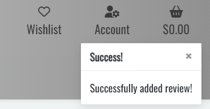
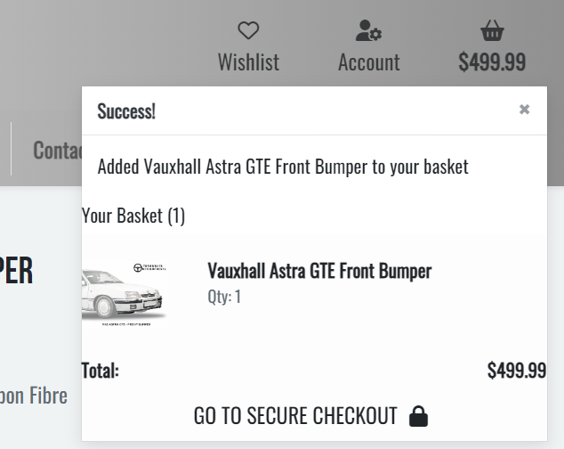

# **TESTING DOCUMENTATION**

## **TABLE OF CONTENTS**

- [**Manual Testing**](#manual-testing)
    * [User Story Testing](#user-story-testing)
    * [Lighthouse](#lighthouse)
- [**Validator Testing**](#validator-testing)
    * [HTML](#html)
    * [CSS](#css)
    * [JavaScript](#javascript)
    * [Python](#python)
- [**Bugs and Errors**](#bugs-and-errors)

## **MANUAL TESTING**

 

### **User Story Testing**

 

- #### **User Story:**

        - As a user, I can quickly understand the sites purpose and navigate through the sites content easily, without any confusion. 

    #### **Acceptance Criteria:**
    * The site structure and layout should be clearly understandable and easy to navigate to all users.
    * Unauthenticed users should have restricted access to any pages that require authentication.
    * Unauthenticated users are redirected to registration or log in pages when selected from the navigation menu.

    #### **Actual Results:**
    * User test carried out by peers, friends and family confirmed the site's purpose was clearly understand and easy to navigate.
    * User test carried out by unauthenticated users confirmed pages requiring authentication provided restricted access and were unable to proceed without a registered account.
    * User test carried out by unauthenticated users confirmed log in and registration links redirected to the correct pages on the site.

    #### All Tests: **Passed**

-----

- #### **User Story:**

        - As a user, I can view a list of featured products on the landing page with clearly visible images, titles and prices and redirect users to the product details when clicked. 

    #### **Acceptance Criteria:**
    * The site's Home page should display a list of featured products selected by the site admin.
    * The featured products section of the Home page should display a product image and basic product information to all users.
    * Featured products should redirect all users to the relevant product details when clicked.

    #### **Actual Results:**
    * All users confirmed the Home page displays a selected number of products.
    * All users confirmed each featured product displays a product image and basic product details consisting of product title, price, category, SKU and rating.
    * All users confirmed featured products redirected to the correct product details when clicked.

    #### All Tests: **Passed**

-----

- #### **User Story:**

        - As a user, I can subscribe to a Newsletter with my email address and receive updates and offers. 

    #### **Acceptance Criteria:**
    * The site's footer should be visible at the bottom of every page of the store.
    * The site's footer should contain a Newsletter sign up allowing users to enter an email address. 

    #### **Actual Results:**
    * All users confirmed the footer is present at the bottom of each page of the site.
    * All users confirmed the Newsletter sign up is present in the footer and functions correctly.

    #### All Tests: **Passed**

-----

- #### **User Story:**

        - As a user, I can make enquiries via the contact form. 

    #### **Acceptance Criteria:**
    * The contact form menu links should be clearly visible to all users and redirect to the contact page.
    * The contact form should be well structured and easily understandle.
    * The contact form should allow all users to submit enquiries.
    * A confirmation notification should display to inform users the message has been submitted.
    * Enquiries submitted through the site's contact form should be visible to superusers in the admin panel.

    #### **Actual Results:**
    * All users confirmed the contact page link was easily located and redirected to the correct page.
    * All users confirmed the contact form is well structured, easy to understand and provides adequate information to submit an enquiry.
    * All users confirmed their enquiries were submitted when submit was clicked.
    * All users confirmed a notification pop up message appears to inform them their enquiry was submitted successfully.
    * Superusers confirmed submitted enquiries are visible in the backend admin panel.

    

    #### All Tests: **Passed**

-----

- #### **User Story:**

        - As a user, I can click each product on the all products page to view the product details including price, SKU, category, description, rating and product reviews. 

    #### **Acceptance Criteria:**
    * The All Products page should display a list of all the available products to all users.
    * Each product should redirect to the appropriate product details page when clicked.
    * The Product Details page should clearly display the product image and detailed product information.
    * The product review section should be visible below the product information to all users.

    #### **Actual Results:**
    * All users confirmed all products are visible in a clear and readable layout.
    * All users confirmed clicking a product successfully redirected to the appropriate product details page.
    * All users confirmed the product details page displayed a clear image and the product information was clearly displayed and easy to read.
    * All users confirmed the product reviews section was displayed below the product information.

    #### All Tests: **Passed**

-----

- #### **User Story:**

        - As a user, I can organise products in the products list by category, rating in descending order and price in ascending order. 

    #### **Acceptance Criteria:**
    * All site users should be able to filter products by category in ascending order.
    * All site users should be able to filter products by price in ascending order.
    * All site users should be able to filter products by its rating in descending order.

    #### **Actual Results:**
    * All users confirmed filtering products by category displayed products in A-Z category order.
    * All users confirmed filtering products by price displayed products from lowest to highest price.
    * All users confirmed filtering products by product rating displayed product ratings starting from highest to lowest.

    #### All Tests: **Passed**

-----

- #### **User Story:**

        - As a user, I can filter products via the search function at the top of the page. 

    #### **Acceptance Criteria:**
    * The Search function should be visible at the top of every page on the site.
    * The Search function should display search results relevant to the searched term.

    #### **Actual Results:**
    * All users confirmed the search bar is visible at the top of each page on the site.
    * All users confirmed the returned search results displayed the correct products matching the search term.

    #### All Tests: **Passed**

-----

- #### **User Story:**

        - As a user, I can easily register for an account and receive an account registration confirmation email to confirm my account. 

    #### **Acceptance Criteria:**
    * Unauthenticated users should be able to easily navigate to the account registration page.
    * Unauthenticated users can enter their details and register for an authenticated user account.
    * Unauthenticated users receive an account registration confirmation notification and email.

    #### **Actual Results:**
    * Users confirmed the account registration was easy to navigate and redirected to the account registration page when clicked.
    * Users confirmed the account registration process is user friendly.
    * Users confirmed a notification pop up message displayed to confirm their account was register successfully and an email confirmation was received.

    

    #### All Tests: **Passed**

-----

- #### **User Story:**

        - As a user, I can easily log in and log out of my account and receive a pop up message alert to notify me of the action. 

    #### **Acceptance Criteria:**
    * Unauthenticated users should be able to navigate to the log in page via the navigation menu.
    * Authenticated users should receive a pop-up notification confirming they have logged in successfully.
    * Authenticated users should receive a pop-up notification confirming they have logged out successfullly.

    #### **Actual Results:**
    * Users confirmed the log in menu link redirects to the account log in page successfully.
    * Users confirmed a pop-up notification message displayed to confirm their log in was successful.
    * Users confirmed a pop-up notification message displayed to confirm their account log out was successful.

    
    

    #### All Tests: **Passed**

-----

- #### **User Story:**

        - As a user, I can add products I like to my wishlist and remove products no longer required.

    #### **Acceptance Criteria:**
    * Authenticated users can navigate to their wishlist via the navigation menu.
    * The Wishlist page displays a list of products added by the user.
    * Authenticated users are able to remove products from their wishlist.
    * Authenticated users should receive a pop-up notification message confirming if a product is added or removed from the wishlist.

    #### **Actual Results:**
    * Users confirmed clicking the Wishlist menu redirected to the Wishlist page. Unauthentiated users confirmed this functionality is restricted without an authenticated account.
    * Users confirmed the Wishlist page displays products added by the user.
    * Users confirmed a pop-up notification message displayed when a product is added or removed from the wishlist.

    
    

    #### All Tests: **Passed**

-----

- #### **User Story:**

        - As a user, I can add product reviews and ratings to products so that others can see my experience. 

    #### **Acceptance Criteria:**
    * Authenticated users are able to add product feedback and ratings to the product reviews section on the product details page.
    * Authenticated users should receive a pop-up notification confirming their product review has been added successfully.

    #### **Actual Results:**
    * Users confirmed the Product Details page displays the product review functionality allowing users to provide written feedback and select a star rating. Unauthenticated users confirmed this functionality is restricted and cannot leave a product review.
    * Users confirmed a pop-up notification displayed to confirm the product review was added successfully.

    

    #### All Tests: **Passed**

-----

- #### **User Story:**

        - As a user, I can access my account information to update my delivery details, view my order history including the order number, date purchased and products purchased. 

    #### **Acceptance Criteria:**
    * Authenticated users are able to navigate to their account via the navigation menu.
    * Authenticated users are able to update their account details and a pop-up notification displays to confirm the changes have been made.
    * Authenticated users can view their order history detailing order numbers, date purchased, product title and order price total.

    #### **Actual Results:**
    * Users confirmed the My Profile navigation menu link redirects to their profile details page.
    * Users confirmed user profile details updated successfully and a pop-up notification displayed to confirm the changes were successful.
    * Users confirmed their order history is visible and displays the correct details.

    

    #### All Tests: **Passed**

-----

- #### **User Story:**

        - As a user, I can add products to my basket so I am able to get a total cost of all the parts I am interested in. 

    #### **Acceptance Criteria:**
    * All users should be able to add products to their shopping basket.
    * All users should receive a pop-up notification confirming the product was added to the basket successfully. The notification should display the product title and price and provide the user with a order total.

    #### **Actual Results:**
    * Users confirmed the add to basket button on the product details pages adds the correct product to the basket.
    * Users confirmed a pop-up notification displayed to confirm the product was added to the basket successfully.
    * Users confirmed the pop-up notification displayed the product title and order price total.

    

    #### All Tests: **Passed**

-----

- #### **User Story:**

        - As a user, I can easily view my order summary including my saved account details and my basket contents before entering my payment details without any confusion. 

    #### **Acceptance Criteria:**
    * All users should be able to navigate to the Shopping Basket page via the basket navigation menu icon.
    * All users should be to view the contents of their basket with information displayed regarding the product details.
    * All users should be able to update the quantities of the items in the basket with the order price total updating to reflect these changes with a pop-up notification appearing confirming the action.
    * All users should be able to removed unwanted items from the basket with the order price total updating to reflect these changes.
    * All users should be able to enter their payment details easily and without confusion.

    #### **Actual Results:**
    * Users confirmed the basket icon on the navigation menu redirected to the Shopping Basket page.
    * Users confirmed the Shopping Basket page displays the correct contents that were added.
    * Users confirmed the quantities of any products in the basket can be updated successfully and a pop-up notification displays to confirm the action.
    * Users confirmed products can be removed from the basket successfully.
    * Users confirmed entering their payment details was an easy and positive user experience.

    

    #### All Tests: **Passed**

-----

- #### **User Story:**

        - As a user, I am able to view a full order confirmation once a payment has been submitted and receive a message informing me my order confirmation email has been sent. 

    #### **Acceptance Criteria:**
    * All users should be redirected to an Order Confirmation page when a payment has been processed successfully and a receive a pop-up notification confirming their order was placed succesfully.
    * All users should receive an email confirmation containing their full order details.

    #### **Actual Results:**
    * Users confirmed they are redirected to an Order Confirmation page with a pop-up notification displaying the order was placed successfully.
    * Users confirmed they received an order confirmation email providing details of their order.

    
    

    #### All Tests: **Passed**

-----

- #### **User Story:**

        - I can quickly and easily add new products to the store via the admin tools menu in the navbar.

    #### **Acceptance Criteria:**
    * Users with superuser authentication should be able to navigate to the Admin Tools page via the navigation menu.
    * Superusers should be able to fill out the product details form and upload a product image.
    * Superusers should be able to select if the product they are uploading is a featured product or not.
    * Superusers should receive a pop-up notification message confirming the product has been added successfully.

    #### **Actual Results:**
    * Superusers confirmed the Admin Tools navigation link redirects to the correct Admin Tools page.
    * Superusers confirmed the add product fields and product image upload function correctly.
    * Superusers confirmed the featured product selection functions correctly and products are added to the Featured Products section of the Home page succesfully.
    * Superusers confirmed they received a pop-up notification message confirming the product was added successfully.

    

    #### All Tests: **Passed**

-----

- #### **User Story:**

        - I can edit a products title, description or image via the product listing page and product details page, so that I can effectively maintain the shop. 

    #### **Acceptance Criteria:**
    * Users with Superuser authentication should be able to effectively manage the shop by editing product details and images directly through the product listing on the store.
    * Superusers should receive a pop-up notification confirming the product was updated successfully.

    #### **Actual Results:**
    * Superusers confirmed products can be edited directly through the product listing on the site. Unauthenticated users confirmed this functionality is restricted.
    * Superusers confirmed they received a pop-up notification confirming the product was updated successfully.

    

    #### All Tests: **Passed**

-----

- #### **User Story:**

        - I can remove products from the site via the product listing page or product details page. 

    #### **Acceptance Criteria:**
    * Users with Superuser authentication should be able to remove products from the store from either the Product Listing page or Product Details page.
    * Superusers should receive a pop-up notification confirming the product has been removed successfully.

    #### **Actual Results:**
    * Superusers confirmed products can be removed directly from the Products Listing and the Product Details pages. Unauthenticated users confirmed this functionality is restricted.
    * Superusers confirmed they received a pop-up notification confirming the product was removed successfully.

    

    #### All Tests: **Passed**

-----

- #### **User Story:**

        - I can update the products that appear in the featured products section.

    #### **Acceptance Criteria:**
    * Users with Superuser authentication should be able to update existing products to appear in the Featured Products section.
    * Superusers should be able to remove products from the Featured Products section.

    #### **Actual Results:**
    * Superusers confirmed existing products can be edited and added to the Featured Products section.
    * Superusers confirmed products can be edited and removed from the Featured Products section.

    #### All Tests: **Passed**

-----

- #### **User Story:**

        - As a user, I can access my account information to update my delivery details, view my order history including the order number, date purchased and products purchased. 

    #### **Acceptance Criteria:**
    * What should happen

    #### **Actual Results:**
    * Results

    #### All Tests: **Passed**

-----

 

### **LIGHTHOUSE TESTING**
Each page on the project was run through the Google Developer Tools Lighthouse checker. This tool provides a score out of 100 for the pages Performance, Accessibility, Best Practices and SEO.

Each screenshot below displays a lower Performance score on mobile than on Desktop devices. This is due to warnings regarding using HTTP/2 and render blocking resources. This is an area I need to research further to resolve.

 

- #### **Home Page**

Device | Result |
--- | --- |
Desktop | 
Mobile | 

 

---

- #### **Product List Page**
Device | Result |
--- | --- |
Desktop | 
Mobile | 

 

---

- #### **Product Details Page**
The Product Details initially scored low on Accessibility due to Button elements, Form elements and Link elements not have accessible names. This was rectified by adding Aria Labels.

Device | Result |
--- | --- |
Desktop | 
Desktop Fixed | 
Mobile | 

 

---

- #### **Contact Page**
Device | Result |
--- | --- |
Desktop | 
Mobile | 

 

---

- #### **Basket Page**
Initially the Basket page on Desktop devices scored low on Accessibility due to the Quantity plus and minus buttons not having accessible names. This was rectified by adding Aria Labels.

Device | Result |
--- | --- |
Desktop | 
Desktop Fixed| 
Mobile | 

 

---

- #### **Checkout Page**
Device | Result |
--- | --- |
Desktop | 
Mobile | 

 

---

- #### **Checkout Sucess Page**
Device | Result |
--- | --- |
Desktop | 
Mobile | 

 

---

- #### **Add Products Page**
Device | Result |
--- | --- |
Desktop | 
Mobile | 

 

---

- #### **My Profile Page**
Device | Result |
--- | --- |
Desktop | 
Mobile | 

 

---

- #### **Log in Page**
Device | Result |
--- | --- |
Desktop | 
Mobile | 

 

---

- #### **Register Account Page**
Device | Result |
--- | --- |
Desktop | 
Mobile | 

 

---

- #### **Sign out Page**
Device | Result |
--- | --- |
Desktop | 
Mobile | 

## **VALIDATOR TESTING**

- ### **HTML**

[HTML](https://validator.w3.org/nu/#textarea) HTML validation provided no errors for all 15 HTML files; basket.html, checkout.html, checkout_success.html, contact.html, enquiry_confirm.html, index.html, add_product.html, edit_product.html, product_details.html, wishlist.html, profile.html, footer.html, main-nav.html, mobile-top-header.html and base.html.

File | Result | Evidence | 
--- | --- | --- |
templates/base.html | Pass | [base.html Validation](docs/read-me/testing/w3c-base-html.png)
templates/basket.html | Pass | [basket.html Validation](docs/read-me/testing/w3c-basket-html.png)
templates/checkout.html | Pass | [checkout.html Validation](docs/read-me/testing/w3c-checkout-html.png)
templates/checkout-success.html | Pass | [checkout-success.html Validation](docs/read-me/testing/w3c-checkout-success-html.png)
templates/contact.html | Pass | [contact.html Validation](docs/read-me/testing/w3c-contact-html.png)
templates/enquiry-confirm.html | Pass | [enquiry-confirm.html Validation](docs/read-me/testing/w3c-enquiry-confirm-html.png)
templates/index.html | Pass | [index.html Validation](docs/read-me/testing/w3c-index-html.png)
templates/add-product.html | Pass | [add-product.html Validation](docs/read-me/testing/w3c-add-product-html.png)
templates/edit-product.html | Pass | [edit-product.html Validation](docs/read-me/testing/w3c-edit-product-html.png)
templates/product-details.html | Pass | [product-details.html Validation](docs/read-me/testing/w3c-product-details-html.png)
templates/wishlist.html | Pass | [wishlist.html Validation](docs/read-me/testing/w3c-wishlist-html.png)
templates/profile.html | Pass | [profile.html Validation](docs/read-me/testing/w3c-profile-html.png)
templates/footer.html | Pass | [footer.html Validation](docs/read-me/testing/w3c-footer-html.png)
templates/main-nav.html | Pass | [main-nav.html Validation](docs/read-me/testing/w3c-main-nav-html.png)
templates/mobile-top-header.html | Pass | [mobile-top-header.html Validation](docs/read-me/testing/w3c-mobile-top-header-html.png)

 

- ### **CSS**
 
[W3C](https://jigsaw.w3.org/css-validator/#validate_by_input) CSS validation provided no errors for Base, Checkout and Profile CSS files.

File | Result | Evidence | 
--- | --- | --- |
static/css/base.css | Pass | [base.css Validation](docs/read-me/testing/w3c-base-css.png)
static/profiles/css/base.css | Pass | [profile/base.css Validation](docs/read-me/testing/w3c-profile-css.png)
static/checkout/css/checkout.css | Pass | [checkout.css Validation](docs/read-me/testing/w3c-checkout-css.png)

 

- ### **JavaScript**

 

- ### **Python**

## **BUGS AND ERRORS**
